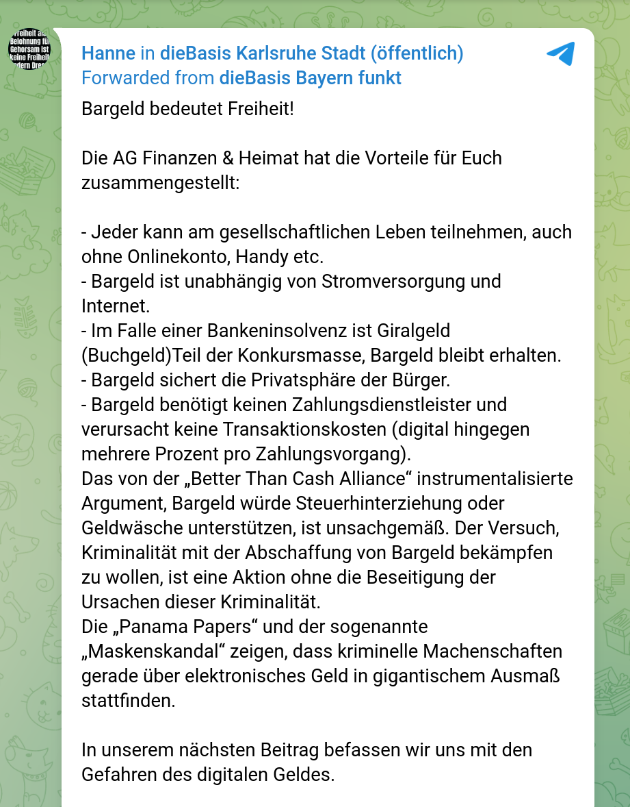
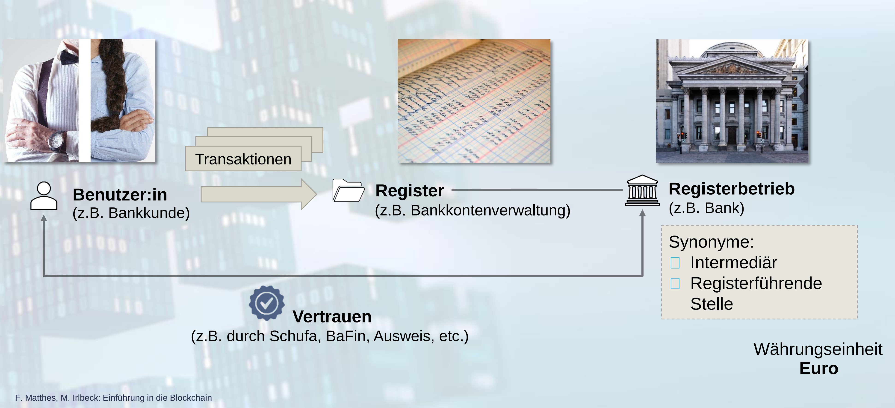

# Kryptowährungen und digitales Zentralbankgeld

<small>*Ein Vortrag von <a href="wiyogo.com">Yongkie Wiyogo</a>*</small>

---

## Motivationen

 <!-- .element height="800" -->

https://t.me/dieBasis_Karlsruhe_Chat/14794

  
----

* Bedeutet Bargeld wirklich Freiheit?      
* Was ist digitales Geld?                  
* Verbirgt digitales Geld Gefahren für uns?

---
<section id="Timeline" data-background-iframe="https://cdn.knightlab.com/libs/timeline3/latest/embed/index.html?source=1iQ-pvw-oRB8MmwWXHwEdsPstTcDelG7Rfa4wDPJKUKE&font=Default&lang=de&initial_zoom=4&height=900" />

---
## Das konzept eines zentralen Kassenbuch

 

---

## Kritik an dem zentralen Kassenbuch
 

* Abhängigkeit von Zentralbanken.
* Die (umstrittene) Entscheidungsträger sind nicht von dem Volk gewählt.
* Nicht mehr von Gold oder reale Werte gekoppelt (Abschaffung der Goldstandard).
* Das unkontrollierte Gelddrucken führt zu einer Entköpplung der Kapitalmärkte von der Realwirtschaft.

---
## Gibt es überhaupt eine Alternative?

---
## Kryptowährung?
 

Kryptowährung = Kassenbuch von Transaktionen  + Kryptography

---
## Blockchain
 

* Alle Transaktionen werden in einem digitalen Kasssenbuch gespeichert. <!-- .element: class="fragment" data-fragment-index="2" -->
* Das digitale Kassenbuch wird auch als "Blockchain" genannt, weil die Transaktionen in verketteten digitalen Blöcken abgespeichert werden. <!-- .element: class="fragment" data-fragment-index="3" -->
* Anstatt in einem Rechner werden die Transaktionen von tausenden Rechnern in einem Netzwerk verifiziert und abgespeichert. <!-- .element: class="fragment" data-fragment-index="4" -->

---
## Blockchain-Typen

1. Offene Blockchain
2. Geschlossene Blockchain
3. Hybrid Blockchain

---
Der Geburt der ersten Kryptowährung mit dem offenen Blockchain

<embed class="stretch"
                    src="https://bitcoin.org/bitcoin.pdf" width="100%"
                    height="900vh" alt="pdf" pluginspage="http://www.adobe.com/products/acrobat/readstep2.html">

---

<iframe class="stretch"  src="https://www.youtube.com/embed/sGBKSnA9Qs4?t=121" title="Aber wie Funktioniert Bitcoin?" frameborder="0" allow="accelerometer; autoplay; clipboard-write; encrypted-media; gyroscope; picture-in-picture" allowfullscreen></iframe>

---
## Selbst Erkundung
 

https://www.bitrawr.com/bitcoin-node-map 

https://www.blockchain.com/btc/blocks

---
## Geschlossene Blockchain / Zentrale Kryptowährung
 

* Die verwendete Blockchain-Technologie wird nicht offen publiziert.
* Die daraus resultierte Kryptowährung ist von einer bestimmten geschlossenen Gruppe, Stiftung oder einem Institut kontrolliert.
* auch als _Distributed Ledger Technology (DLT)_ genannt
* Beispiel: Ripple, Terra Luna, IBM Blockchain, Facebook Diem (ehemals Libra), Central Bank Digital Currency

---
## Central Bank Digital Currency

<embed class="stretch"
                    src="assets/FTNEA2022004.pdf" width="100%"
                    height="900vh" alt="pdf" pluginspage="http://www.adobe.com/products/acrobat/readstep2.html">

---
## Edward Snowden zu CBDC

 

_"Vielmehr werde ich Ihnen sagen, was ein CBDC NICHT ist – es ist NICHT, wie Wikipedia Ihnen sagen könnte, ein digitaler Dollar. Schließlich sind die meisten Dollars bereits digital und existieren nicht als etwas, das in Ihrer Brieftasche gefaltet ist, sondern als Eintrag in der Datenbank einer Bank, der gewissenhaft angefordert und unter dem Glas Ihres Telefons wiedergegeben wird. Eine digitale Währung der Zentralbank ist auch keine Umarmung der Kryptowährung auf staatlicher Ebene – zumindest nicht der Kryptowährung, wie so ziemlich jeder auf der Welt, der sie verwendet, sie derzeit versteht."_

 

https://edwardsnowden-substack-com.translate.goog/p/cbdcs?_x_tr_sl=auto&_x_tr_tl=de&_x_tr_hl=en, 09.10.2021

---
## Kryptowährung mit starkem Datenschutz
 

* Monero (XMR)
* PRivaCY Coin (PRCY)
* ZCash (ZEC)
* Pirate Chain (ARRR)

---
## Legalität der Kryptowährung Weltweit
 

* Mehrere Verbote in China seit 2009
* Transaktion-Verbot in Algerien, Bolivien, Ägypten, Irak, Marokko, Nepal, Pakistan, Vietnam und die Vereinigten Arabischen Emirate, Bahrain, Bangladesch, China, Kolumbien, Dominikanische Republik, Indonesien, Kuwait, Lesotho, Litauen, Macau, Oman, Katar, Saudi-Arabien und Taiwan.
* Offiziel eingeführt in El Salvador und Zentralafrikanische Republik
* In 2022 akzeptiert Ukraina Bitcoin als Spende für Krieg gegen Russland

---

## Nutzer der Kryptowährung
 

* [Wikileaks](https://shop.wikileaks.org/donate): Bitcoin, Litecoin, Monero, Zcash, Ethereum
* [Reitschuster.de](https://reitschuster.de/unterstuetzung): Bitcoin
* [OVALmedia](https://www.oval.media/spendendetails/): Bitcoin und Monero
* und noch viel mehr ...

---
## Bargeld oder Bargeldlos

<embed class="stretch"
src="https://www.mckinsey.com/~/media/mckinsey/industries/financial%20services/our%20insights/accelerating%20winds%20of%20change%20in%20global%20payments/2020-mckinsey-global-payments-report-vf.pdf" width="100%"
height="900vh" alt="pdf" pluginspage="http://www.adobe.com/products/acrobat/readstep2.html">

---
## Bitcoin zusammengefasst
 

* Bitcoin ist ein verteiltes Peer-to-Peer-System => dezentrales System
* Bitcoin-Transaktionen werden in einer digitalen Blockkette (Blockchain) gespeichert
* 1 Block ~ 1900 Transaktionen
* Maximalvorrat: 21.000.000 BTC Coins -> wie digitales Gold
* Bitcoin ist nicht 100% anonym.
* Man braucht weder Regierung noch Bank noch ein drittes privates Institut um das Geldsystem zu verwalten oder zu verifizieren
* Komplizierter Einstieg für nicht IT-ler
* Starke Volatilität (Kurs-Schwankungen)

---
## Fazit
 

* Nicht nur Bargeld bedeutet Freiheit, sondern auch Bitcoin und die anonymen Kryptowährungen.
* Bitcoin und die anonymen Kryptowährungen kann für eine parallele Gesellschaft benutzt werden (Schattenwirtschaft).
* Nur Kryptowährung mit geschlossenen Blockchain-Technologie verbergen Gefahren für unsere Demokratie und Freiheit.

---

Wenn Du innere Zufriedenheit hast, bist Du der reichste alller Menschen, selbst wenn man Dir alles stehlen würde.

 
 

Wenn Dir aber diese Zufriedenheit fehlt, egal, wie reich Du sein magst, bist Du der Sklave Deines Reichstums.

 

<em>Nagarjuna</em>

---
## Fragen und Diskussion
 

Welches Geldsystem würden Sie denn gerne, zentrales oder dezentrales Geldsystem?

 

Vielen Dank für die Aufmerksamkeit

